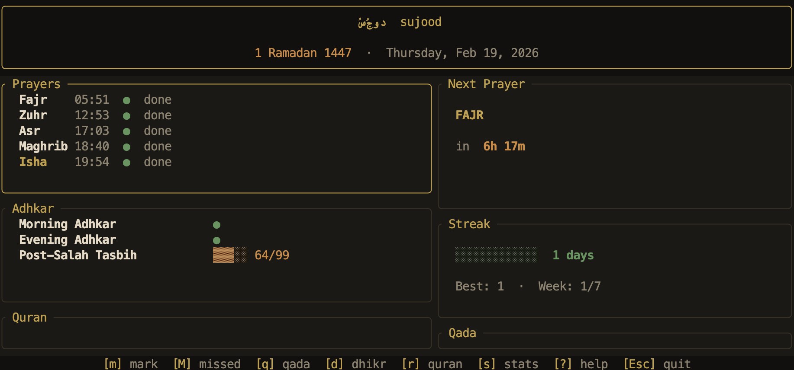

<div align="center">

# سُجُود &nbsp; sujood

**A quiet terminal companion for your daily Islamic practice.**

*Fully offline · No accounts · No tracking · Just presence.*



</div>

---

## What it is

Sujood is a terminal app for tracking the five daily prayers, adhkar, Quran reading, and qada — all stored locally, all computed offline. It does not connect to the internet at any point after setup.

Built with a warm dark aesthetic intended to feel calm and intentional, not like a productivity dashboard.

---

## Features

- **Prayer times** — computed offline via astronomical algorithms (13 calculation methods, Hanafi/Shafi madhab)
- **Prayer tracking** — mark each prayer done or missed; missed prayers go into the qada queue automatically
- **Adhkar** — checkbox and counter types; morning, evening, and post-salah tasbih built in; add your own
- **Quran log** — track daily pages with a progress bar toward your daily target
- **Qada queue** — keeps count of owed prayers with a payback estimate
- **Streak tracker** — consecutive days with all 5 prayers completed
- **Hijri date** — shown in the header with local moon-sighting offset support
- **Full TUI dashboard** — live countdown to next prayer, all panels in one view
- **CLI commands** — quick one-liners for every action, pipe-friendly export

---

## Installation

**Prerequisites:** Rust 1.85+ (`rustup update`)

**Install it from `crates.io`** : 
```bash
cargo install sujood
```

or install it by manually building

```bash
git clone https://github.com/simplysabir/sujood
cd sujood
cargo install --path .
```

Or run directly without installing:

```bash
cargo run
```

---

## First run

```bash
sujood setup
```

A full-screen TUI wizard will guide you through:

1. City name (display only)
2. Latitude & longitude
3. Calculation method (13 options: Muslim World League, Karachi, Umm al-Qura, etc.)
4. Madhab (Hanafi / Shafi — affects Asr time)
5. UTC offset (accepts `+5:30`, `-3`, `+5.5`)
6. Hijri date preference (astronomical or local moon sighting)

Prayer times are cached for 90 days entirely offline. Re-run `sujood setup --reset` any time to reconfigure.

---

## Dashboard

```
sujood
```

| Key | Action |
|---|---|
| `↑` `↓` | Navigate items |
| `Tab` | Switch focus between Prayers / Adhkar |
| `m` / `Enter` | Mark focused prayer as done |
| `M` | Mark focused prayer as missed (adds to qada) |
| `d` | Toggle / increment focused dhikr |
| `r` | Log Quran pages (opens input prompt) |
| `q` | View qada queue |
| `s` | Stats view (7-day heatmap, streaks) |
| `?` | Keybinding help overlay |
| `Esc` | Quit |

---

## CLI commands

```bash
# Prayer times
sujood times                        # today's times + countdown to next prayer

# Mark prayers
sujood mark fajr                    # mark Fajr as done
sujood mark zuhr --missed           # mark Zuhr missed → adds to qada queue

# Qada
sujood qada list                    # view queue + estimated days to clear
sujood qada complete                # mark oldest qada as done
sujood qada add asr                 # manually add to queue

# Adhkar
sujood dhikr morning                # mark morning adhkar done
sujood dhikr evening                # mark evening adhkar done
sujood dhikr mark "Post-Salah Tasbih" --count 33
sujood dhikr list                   # show all dhikr with today's progress
sujood dhikr add "Istighfar" --type counter --target 100 --freq daily

# Quran
sujood quran 2                      # log 2 pages read today
sujood quran 0.5                    # fractions work too

# Stats
sujood stats                        # streak, qada count, weekly total
sujood stats --week                 # ASCII heatmap for the last 7 days

# Export
sujood export                       # plain-text weekly summary to stdout
```

---

## Configuration

Config file: `~/Library/Application Support/sujood/config.toml` (macOS) or `~/.config/sujood/config.toml` (Linux)

```toml
[salah]
location_name   = "Mumbai"
latitude        = 19.0748
longitude       = 72.8856
calc_method     = "Karachi"       # see list below
madhab          = "Hanafi"        # Hanafi | Shafi
timezone_offset = 330             # minutes from UTC (+5:30 = 330)
hijri_offset    = -1              # 0 = astronomical · -1 = local moon sighting

[quran]
daily_target = 2                  # pages per day goal

[dhikr]
enabled = true
```

**Calculation methods:** `MuslimWorldLeague` · `Egyptian` · `Karachi` · `UmmAlQura` · `Dubai` · `MoonsightingCommittee` · `NorthAmerica` · `Kuwait` · `Qatar` · `Singapore` · `Tehran` · `Turkey` · `Other`

---

## Data

All data is stored in a local SQLite database:

- **macOS:** `~/Library/Application Support/sujood/sujood.db`
- **Linux:** `~/.local/share/sujood/sujood.db`

Nothing leaves your machine.

---

## License

MIT © [Sabir Khan](https://github.com/simplysabir)
